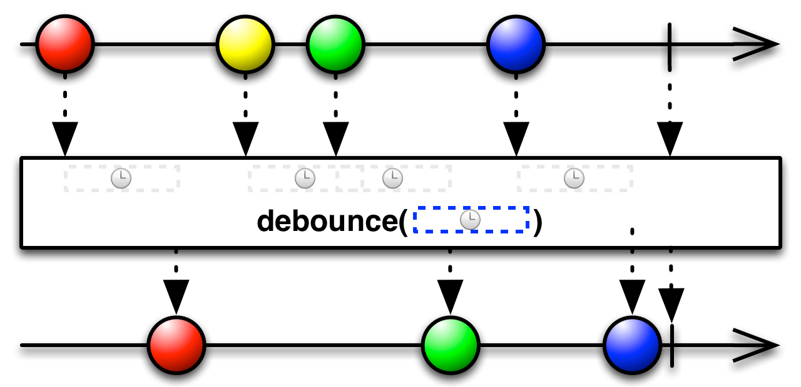

# Introductie

Ontwikkelaars krijgen steeds meer tools aangereikt om asynchrone afhandeling van applicatielogica mogelijk te maken. Asynchrone programmalogica biedt voordelen t.o.v. synchrone code, omdat er efficiënter gebruik kan worden gemaakt van de beschikbare resources. Zo kun je bijvoorbeeld een database query uitvoeren en terwijl je wacht op het resultaat een webservice request kunnen uitvoeren. Er zijn verschillende mogelijkheden om asynchrone code te schrijven. Voor javascript ontwikkelaars is het bijvoorbeeld vanzelfsprekend om gebruik te maken van callbacks. Sinds versie 8 is deze mogelijkheid er ook in Java in de vorm van Lambda statements. Ook kan er gebruik worden gemaakt van multi-threading, van patterns zoals een event-loop, van co-routines (nodejs, kotlin) en van libraries als reactive extensions (RxJava, RxJS). Asynchrone afhandeling is vooral voordelig als we te maken hebben met interactie tussen applicaties. Het meest populaire protocol hiervoor is echter REST. Gebaseerd op HTTP is dit een synchroon protocol.
In dit artikel kijken we aan de hand van een voorbeeld naar een alternatief in de vorm van websockets. We zullen een systeem bouwen met een Angular frontend en een Vert.x backend. Voor de asynchrone afhandeling maken gebruik van Observables in RxJS en RxJava. Het voorbeeld gebruikt websockets omdat dit een populaire standaard is. Het principe kan echter ook worden toegepast op vergelijkbare protocollen zoals bijvoorbeeld TCP.

# Use case

Aan de hand van de volgende usecase zullen we laten zien wat de kracht van Reactive Extentions is. We zullen verschillende operators gebruiken en bespreken. De usecase is gekozen zodat we te maken hebben met asynchrone data communicatie die over tijd wordt uitgevoerd. Dit is precies het domein waar Reactive Extentions het best tot zijn recht komt. Door gebruik te maken van RxJS en RxJava houden we de code compact en leesbaar.

We maken een webapplicatie waarin gebruikers kunnen zoeken naar films. De hoofdfunctionaliteit bestaat uit een tekstveld waar zoek termen ingetikt kunnen worden. De applicatie toont vervolgens direct de gevonden films, terwijl ze uit de database worden gestreamd.


De filmdatabase waar de applicatie gebruik van maakt kan veel films bevatten. Een zoekresultaat kan dus potentieel veel resultaten opleveren. Het resultaat zal dus asynchroon naar de browser moeten worden gepushed, zodat de gebruiker niet lang hoeft te wachten totdat er films op het scherm verschijnen.
Elke keer als de gebruiker een letter intikt, zal het zoekresultaat moeten worden aangepast. Hierbij is het belangrijk dat de gebruiker geen oude zoekresultaten voorgeschoteld krijgt.

# Technologie

Voor het versturen van de zoekterm en het ontvangen van de resultaten zullen we gebruik maken van een Websocket verbinding. Websockets maken het mogelijk om full-duplex asynchrone communicatie uit te voeren. Dit in tegenstelling tot REST, waarbij er altijd sprake is van een synchrone Request en Response. Met REST is het voor ons dus niet mogelijk om het zoekresultaat naar de browser te pushen in de vorm van een Stream.
In dit voorbeeld maken we gebruik van een Angular 4 frontend en een Vert.x 3 backend. Beide frameworks bevatten websocket API's die gebruik maken van Reactive Extensions. In Angular kun je dus gebruik maken van RxJS en in Vert.x van RxJava. Beide kanten van de lijn maken dus gebruik van Observables, wat ervoor zorgt dat de frontend en backend API's erg op elkaar lijken.

# Backend

De backend heeft voor iedere browserclient een websocket connectie. Via deze connectie komen berichten binnen. In ons geval representeren de berichten een zoekterm voor het zoeken naar films. Elke keer als de gebruiker een nieuwe letter typt, krijgen we een nieuwe zoekterm binnen. Het is dus zaak dat deze zoekacties snel achter elkaar kunnen worden uitgevoerd. Hiernaast is het nodig om elke vorige zoekactie te annuleren als er een nieuwe zoekactie voor dezelfde client binnenkomt. Dit doen we om te voorkomen dat de gebruiker oude resultaten ziet bij zijn nieuwe zoekterm.
Het volgende code snippet toont de belangrijkste functionaliteit voor het verwerken van deze zoekacties.

```java
HttpServer server = vertx.createHttpServer(); //1
Observable<ServerWebSocket> wsStreamObservable
      = server.websocketStream().toObservable(); //2
    wsStreamObservable.subscribe( //3
      socket -> { //4
        socket.toObservable() //5
          .map(buffer ->
              Json.decodeValue(buffer.toString("UTF-8"), WSAction.class)) //6
          .filter(action -> action.isSearch()) //7
          .map(action -> action.getBody()) //8
          .filter(searchTerm -> searchTerm.length() >= 3) //9
          .switchMap(movieService::findMovies) //10
          .map(movie -> movie.encode()) //11
          .subscribe(socket::writeTextMessage); //12
      }
    );
```

_Listing 1_

Op regel 1 maken we een nieuwe Vert.x HTTP server aan. Deze kan HTTP(s) en Websocket verbindingen voor verschillende clients faciliteren. Op regel 2 vragen we de websocket stream op voor deze server. Deze transformeren we tot een Observable. Dit maakt het mogelijk ons de abonneren op nieuwe websocket connecties (wsStreamObservable.subscribe, regel 4).
Per client krijgen we een nieuwe socket binnen (regel 4). Deze socket representeert de verbinding tussen de server en de client. Via deze socket ontvangen we dus berichten en kunnen we berichten terugsturen. Hiervan maken we wederom een Observable (regel 5). Tot zover het opzetten van de verbindingen.
De berichten komen binnen als bytes. Deze gaan we eerst vertalen naar een JSON representatie, welke we vervolgens direct omzetten naar een Java object. Hiervoor maken we gebruik van de Rx map operator (regel 6).
De map operator voert een functie uit op elk van de items en retourneert het resultaat als een Observable. In dit geval komt er voor elke zoekactie een buffer instantie binnen die wordt omgezet naar een WSAction object, zie hiervoor het marble diagram in Diagram 1. Marble diagrams zijn visuele representaties van functionele operators.


_Diagram 1: map_

Vervolgens willen we alleen zoekacties gaan afhandelen. Het is mogelijk dat we via dezelfde websocket connectie andere acties binnen krijgen. We willen in onze stream dus alleen de zoekacties doorlaten en andere acties negeren. Hiervoor gebruiken we een filter (regel 7). Een filter laat alleen items door die voldoen aan het meegegeven predicaat. In dit geval is dat action.isSearch(). Dit resulteert weer in een nieuwe Observable, die alleen de doorgelaten items bevat.


_Diagram 2: filter_

We willen van deze zoekactie de body hebben, deze bevat namelijk de zoek term. Hiervoor gebruiken we wederom een map operator(8). Om te zorgen dat we alleen zoekacties van 3 of meer karakters verwerken gebruiken we wederom een filter (9).

Als de gebruiker een nieuw karakter intikt, krijgen we via de websocket verbinding een nieuwe zoekterm binnen. Op dat moment zijn we nog de vorige zoekacties aan het verwerken. Deze moeten we op dus annuleren. Als je dit uit zou implementeren zonder Observables, dan zou de code er uit kunnen zien als in Listing 2.

```java
  WSAction action = null;

  try {
    action = Json.decodeValue(message, WSAction.class);
  } catch (DecodeException e) {
    ws.writeTextMessage(new JsonObject()
            .put("status", "invalid request").encode());
  }

  if (action != null && action.isSearch()) {
    Subscription existingSearch = subscriptions.get(ws.textHandlerID());
    if (existingSearch != null) { //1
      existingSearch.unsubscribe(); //2
    }

    Subscription newSearch
      = movieService.findMovies(action.getBody()).subscribe(movie -> { //3
      ws.writeTextMessage(movie.encode());
    });

    subscriptions.put(ws.textHandlerID(), newSearch); //4
```

_Listing 2_

In deze implementatie van de zoek functionaliteit houden we een map van subcriptions bij op basis van het textHandlerID. Dit ID representeert een verbinding met een client.
We moeten hier dus expliciet controleren of er een bestaande zoekactie is (1). Als deze bestaat, roepen we hier unsubscribe aan, zodat de actie wordt geannuleerd (2).
We moeten vervolgens een nieuwe Subscription aanmaken (3) en deze aan de map toevoegen (4). Hierdoor introduceren we een expliciete variabele waarin we state moeten bijhouden, de map met subscriptions.


_Diagram 3: switchmap_

De switchmap kan dit voor ons afhandelen. Een switchmap subscribed op een Observable, in ons geval op het resultaat van het filter op regel 9. Voor elke zoekterm beginnen we met het ophalen van films door het aanroepen van de findMovies methode op onze movieService. Deze findMovies geeft een Observable van films terug in JSON formaat (Listing 3).
Per zoekterm krijgen we dus meerdere films binnen over tijd. Op het moment dat er een nieuwe zoekterm binnenkomt uit de Observable van het filter in regel 9, dan zorgt de switchmap ervoor dat er een unsubscribe plaats vindt op de Observable die terugkomt uit findMovies methode en die behoorde bij de oude zoekterm. De findMovies methode wordt opnieuw uitgevoerd met de nieuwe zoekterm en er vindt een subscribe plaats op de nieuwe Observable die de films bevat die horen bij deze nieuwe zoekterm.

```java
public Observable<JsonObject> findMovies(String keyword);
```

_Listing 3_

Tot slot gebruiken we nogmaals een map operator om de films om te zetten naar een JSON formaat wat we als websocket response kunnen teruggeven. Het terugsturen van de films over de websocket verbinding doen we in de subscribe methode (regel 12).

# Frontend

Nu we een mooie api hebben staan moeten we uiteraard nog films gaan tonen aan de gebruikers. Zoals genoemd gebruiken we hiervoor Angular 4 in combinatie met TypeScript. Het project is gegenereerd met de Angular CLI[1] . We hanteren daarnaast zoveel mogelijk de officiële styleguide van Angular[2].

De frontend bestaat uit verschillende pagina's, wat onze container componenten zijn. De meeste actie vindt plaats op de zoek pagina. Hiervoor is een search component aangemaakt. Op de zoekpagina vinden we een tekstveld waarme we uiteindelijk searchterms over de websocketconnectie versturen naar de backend. De resultaten die terugkomen renderen we netjes met een apart component.

```javascript
private socket$ = Observable.webSocket('ws://localhost:8080'); // 1
```

_Listing 4_

Het eerste wat we moeten doen is het opzetten van een websocket connectie. In RxJS is hiervoor een speciale operator, namelijk de `webSocket` operator. Deze is te vinden in een speciale `dom` folder in de rxjs module. Op regel 1 is te zien dat we de websocket laten verwijzen naar de opgezette websocket in de backend. De websocket is een speciale Observable. Hij fungeert namelijk zowel als een Observable (dus een bron van data), maar ook als Observer (consument van data). Zo'n Observable die ook Observer interfaces implementeert noemen we ook wel een `Subject`. De conventie is tevens om Observables te denoteren met eindigend met een $.

```javascript
ngOnInit() {
  this.searchTerm.valueChanges                          // 1
    .filter(searchTerm => searchTerm.length >= 3)       // 2
    .debounceTime(300)                                  // 3
    .distinctUntilChanged()                             // 4
    .subscribe(searchTerm => this.search(searchTerm));  // 5

    // Setup for websocket results
}
```

_Listing 5_

Het tweede wat we moeten doen is luisteren naar veranderingen in het zoekveld (in de code searchTerm). Dit zetten we op, op het moment dat het component in de DOM wordt gezet. In Angular gebruiken we hiervoor de `OnInit` lifecycle hook van een component. Vervolgens laat Angular nog meer krachtige mogelijkheden zien. We kunnen namelijk met één regel code een Observable krijgen van het zoekveld met `valueChanges`. Dit werkt overigens alleen met een `FormControl`.

Nu kunnen we natuurlijk direct waardes over de lijn sturen, maar we kunnen het veld wat slimmer maken. Een eerste stap die we hierin maken is door alleen te acteren op drie of meer karakters. Hiervoor gebruiken we de reeds bekende `filter` operator.

Een verdere optimalisatie die we kunnen doen is door alleen een zoekterm te versturen als we kunnen aannemen dat de gebruiker klaar is met typen. Hiervoor kunnen we de `debounceTime` operator toepassen. **REGEL** Hiermee geven we aan dat we pas verder willen gaan met de data uit de Observable als er minstens 300ms geen nieuwe data uit de Observable komt.


_Diagram 4: debouncetime_

We kunnen de client nog efficienter maken door alleen zoektermen te versturen die ongelijk zijn aan de vorige verstuurde zoekterm. Dit aangezien deze toch dezelfde resultaten zullen opleveren. Ook hier heeft ReactiveX een operator voor. Dat is de zogenaamde `distinctUntilChanged` operator. Hierna subscriben we op deze hele ketting aan operatoren en gaan we de zoekterm afhandelen.


_Diagram 5: distinctUntilChanged_

```javascript
search(searchTerm: string) {
    this.movies = [];       // 1
    this.socket$.next(      // 2
      JSON.stringify({      // 3
        action: 'search',   // 4
        body: searchTerm    // 5
      })
    );
  }
```

_Listing 6_

Elke keer als we een nieuwe zoekaktie starten voor een nieuwe zoekterm maken we de resultaten van de vorige zoekaktie leeg. Op regel 2 zien we dat we met de `next` methode een nieuwe waarde over de websocket sturen. We converteren op regels 3 t/m 5 een nieuw object met de gespecificeerde zoekterm en actie tot een string die door de backend wordt geaccepteerd.

```javascript
ngOnInit() {
    // Search field observable setup

    this.socket$                                    // 1
      .filter(movie => movie.hasOwnProperty('_id')) // 2
      .subscribe(                                   // 3
        movie => this.movies.push(movie as Movie),  // 4
        err => console.log('error:', err),          // 5
        () => console.log('complete')               // 6
      );
  }
```

_Listing 7_

De afhandeling van de resultaten zetten we ook op in de component initialisatie. We subscriben op de socket en voor elk stuk data kijken we of het een film betreft. Op regel 2 is dit te zien met behulp van wederom een `filter`. Vervolgens zetten we de resultaten in de movies array op regel 4. Dit wordt in de view direct gerenderd door Angular's templating engine. Tot slot maken we op regel 5 en 6 een basale error respectievelijk completion afhandeling aan.

# Conclusie

Ondanks de vrij grote mate van complexiteit in het opzetten en afhandelen van alle asynchroniteit in de applicatie is de code zeer goed te volgen. Het is compact, to the point en semantisch redelijk vanzelfsprekend. Het afhandelen van een data stream door middel van een pipe waar de data doorheen gaat is krachtig en makkelijker mee te werken dan bijvoorbeeld callbacks. Daarnaast geeft het scheiden van databron (Observable) en dataconsument (Observer) ons flexibiliteit. Het is op deze manier mogelijk om meerdere en verschillende afhandelingen voor eenzelfde databron te definiëren. Ook geeft het ons de mogelijkheid om eenzelfde API te gebruiken in zowel de frontend (RxJS) als de backend (RxJava). Bekend zijn met de ReactiveX operators heeft hier dus voor zowel frontend als backend werk toegevoegde waarde.

ReactiveX is al met al een goede toevoeging aan de toolkit van elke developer. De mogelijkheden en toepassingen ervoor zijn eindeloos. Daarnaast is het zeer goed gedocumenteerd. Denk de volgende keer bij een project met asynchroniteit dus zeker aan de Reactive Extensions library!

De volledige source code van dit project is te vinden op: https://github.com/erwindeg/ultimate-async-stack.

[1](https://cli.angular.io)
[2](https://angular.io/guide/styleguide)
[3]
